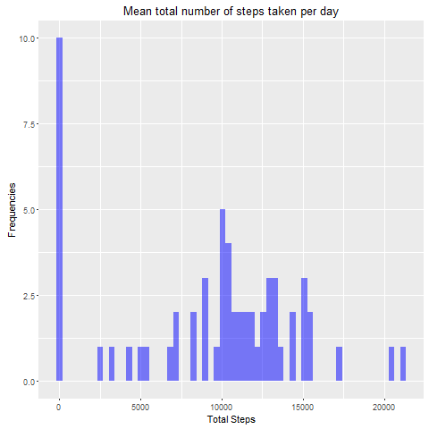
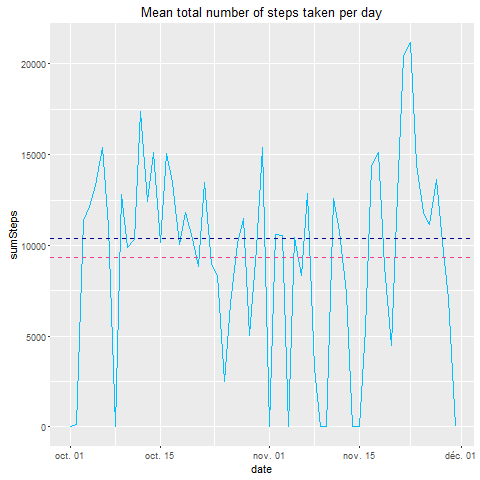
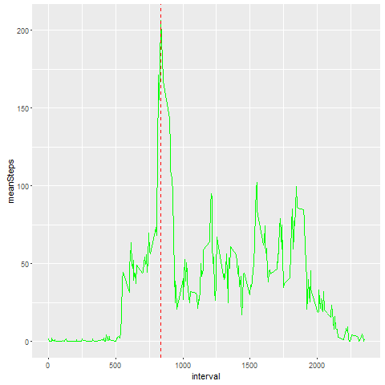
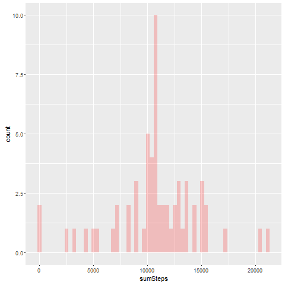
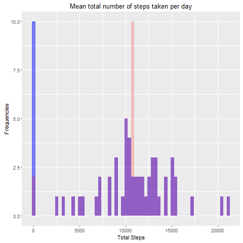
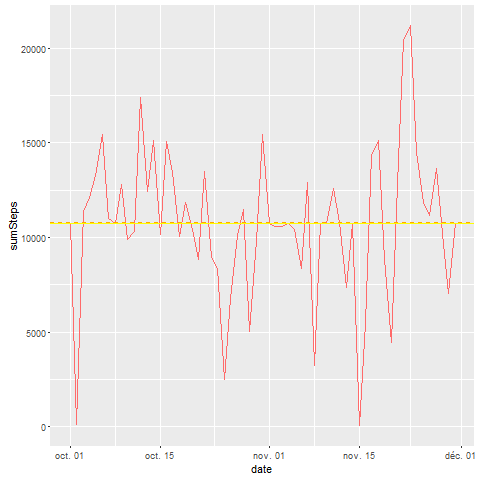
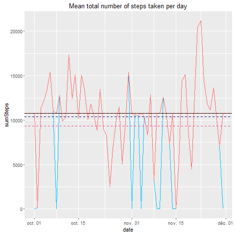
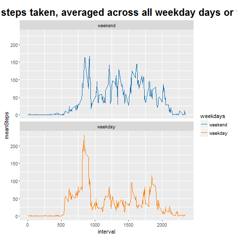

# Reproducible Research: Peer Assessment 1
Frederic Bevia  
March 13, 2016   


## Loading and preprocessing the data

### loading libraries

 We will use dplyr for grouping and filtering data
 
 We are using timedate to create a new factor variable in the dataset with two levels  "weekday" and "weekend" 


### loading libraries


```r
activity <- read.csv("D:/Coursera/Reproductible Research/Devoir/Week1/Data/activity.csv", stringsAsFactors=FALSE)
```

### preprocessing the data

here we are testing if there are NA value in the steps,
we extract the indexes of missing values
then  we're converting the strings date in date format


```r
NbNaSteps<- length(activity$steps[is.na(activity$steps)])
if (NbNaSteps > 0) {sprintf("There are NA values") }
```

```
## [1] "There are NA values"
```

```r
ixNa <-which(is.na(activity$steps))
activity$date <-as.Date(activity$date)
```

## What is mean total number of steps taken per day?

Firts we compute some values: 
 the number of row (i.e measures)
 then the numbers of days


```r
ldays <- length(activity$date)
nbdays<- as.numeric(activity$date[ldays] -activity$date[1])
```

Then we group the rows bay days, so as to compute the Total of steps by day, with the sum function
By the way we also compute the mean and the median, since it is required in the question


```r
# 

group_by(activity,date) %>% summarize(sumSteps  = sum(steps,na.rm =TRUE) ) -> Activity.byDay

head(Activity.byDay)
```

```
## Source: local data frame [6 x 2]
## 
##         date sumSteps
##       (date)    (int)
## 1 2012-10-01        0
## 2 2012-10-02      126
## 3 2012-10-03    11352
## 4 2012-10-04    12116
## 5 2012-10-05    13294
## 6 2012-10-06    15420
```

```r
meansteps <- mean(Activity.byDay$sumSteps)
mediansteps <- median(Activity.byDay$sumSteps) 

sprintf("The Mean of the total steps by days is: %s", meansteps)
```

```
## [1] "The Mean of the total steps by days is: 9354.22950819672"
```

```r
sprintf("The Median of the total steps by days is: %s", mediansteps)
```

```
## [1] "The Median of the total steps by days is: 10395"
```


 Now , we can do some plotting...
 
###  Histogram of the Total Steps by days




###  Line graph of the of the Total Steps by days, with median and mean added

Here we are plotting total steps by days with mean and median added


The mean line is in violet and the median line is in blue, with dashes




## What is the average daily activity pattern?

First we group by interval and then compute the mean by interval


```r
group_by(activity,interval) %>% summarize(meanSteps  = mean(steps,na.rm =TRUE) ) -> Activity.byInterval
head(Activity.byInterval)
```

```
## Source: local data frame [6 x 2]
## 
##   interval meanSteps
##      (int)     (dbl)
## 1        0 1.7169811
## 2        5 0.3396226
## 3       10 0.1320755
## 4       15 0.1509434
## 5       20 0.0754717
## 6       25 2.0943396
```

Then we create the plot, but without printing in a file


Now we compute the max interval of the average day, output it at the console
and adding a red dashed vertical line at the max coordinate on the x-axis
and then we plot


```r
# computing the max interval of the average day
maxsteps<-max(Activity.byInterval$meanSteps)
maxinter<- filter(Activity.byInterval, meanSteps == max(meanSteps))$interval
hour <- 835 %/% 60
mns <- 835 %% 60
sprintf("The 5-minute interval, on average across all the days in the dataset, which contains the maximum number of steps: %s", maxinter)
```

```
## [1] "The 5-minute interval, on average across all the days in the dataset, which contains the maximum number of steps: 835"
```

```r
sprintf("Which corresponds to: %sh %smns", hour,mns)
```

```
## [1] "Which corresponds to: 13h 55mns"
```

and then we plot.......





## Imputing missing values

For the missing values we choose to replace them with the steps of each interval of the average day wich
we have previously computed in the preceding question
But firts we print out the number of missing values 


```r
# the total missing value is  NbNaSteps
sprintf("The total of missing value is: %s", NbNaSteps)
```

```
## [1] "The total of missing value is: 2304"
```

```r
#
```


Now we create a second dataset
then a vector with the indexes of the missing values (NA) in the column steps
and a vector with the same lenght, full of zeroes.
This vector will be filled with the average steps by interval from the preceding question


We're looping thru the 280 intervals, and for each of them put the rounded mean value in the index of the vector Tz corresponding of the element of the vector t1 (which represent an interval with no value)
then we affect the TZ to the colomn steps of the dataset


```r
for (i in 1:length(Activity.byInterval$interval)){tz[which(t1 %in% Activity.byInterval$interval[i])] <- round(Activity.byInterval$meanSteps[i])}
activity2$steps[ixNa] <- tz
head(activity2)
```

```
##   steps       date interval
## 1     2 2012-10-01        0
## 2     0 2012-10-01        5
## 3     0 2012-10-01       10
## 4     0 2012-10-01       15
## 5     0 2012-10-01       20
## 6     2 2012-10-01       25
```

To compare, we compute the Total of activity by day, we the mean and the median


```r
group_by(activity2,date) %>% summarize(sumSteps  = sum(steps,na.rm =TRUE) ) -> Activity2.byDay
head(Activity2.byDay)
```

```
## Source: local data frame [6 x 2]
## 
##         date sumSteps
##       (date)    (dbl)
## 1 2012-10-01    10762
## 2 2012-10-02      126
## 3 2012-10-03    11352
## 4 2012-10-04    12116
## 5 2012-10-05    13294
## 6 2012-10-06    15420
```

```r
mean2steps <- mean(Activity2.byDay$sumSteps)
median2steps <- median(Activity2.byDay$sumSteps) 
```

Then we plot ....




### Comparing with the first histogram




We can see that the main difference is for zero activitie, and for the value arround the mean, wich is normal

plotting total steps by days with mean and median added, mean in orange, median in yellow line




We can see that the median and the mean are near the same line

###  Comparing with the first time serie plot 

here the mean and the median of the second time serie are in red and black (dashed)
and the second time serie   is in indianred




We can see that the main difference is arround the 10 october, and in november were some days had missing values and now seems to have activity because we completed these values

## Are there differences in activity patterns between weekdays and weekends?

First we created a factor we the function isweekday, wihich is independat of the locale (aka the language used for the days. If i hadn't use that, since i'm french, i would have use "lundi", "mardi"... for days and my script would not run in another country)
Then we groupby days and interval


```r
week <- isWeekday(activity2$date)
activity2$weekdays <- factor(week,levels=c(FALSE, TRUE), labels=c('weekend', 'weekday') )
names(activity2$weekdays)<-NULL

group_by(activity2,weekdays,interval) %>% summarize(meanSteps  = mean(steps,na.rm =TRUE) ) -> Activity2.byInterval
```
Then we plot...




*And we can see that there is much more activity the week-end beetwen 12h and 20h*
